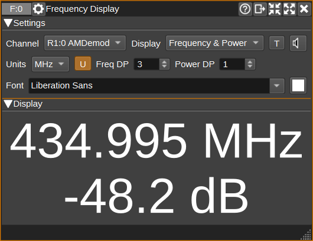
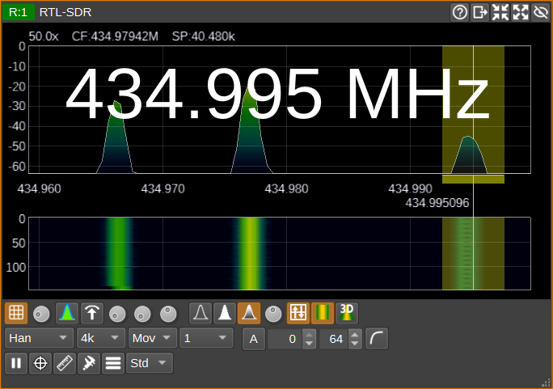

<h1>Frequency Display Plugin</h1>

<h2>Introduction</h2>

The Frequency Display plugin displays the center frequency and/or power of a selected channel.
The displayed values are scaled to the size of the window, so can be made large enough to be visible from a distance.
Optionally, the values can be spoken whenever they change, which may be useful when tuning circuits or antennas and the screen isn't visible.

<h2>Interface</h2>

<h3>1: Channel</h3>

Select which TX or RX channel to display the centre frequency or power for.

In order for the power to be able to displayed, the channel must include a value with the channelPowerDB key in its channel report.

<h3>2: Display</h3>

Choose the text to display:

* Frequency - displays the selected channel's (1) centre frequency in Hz.
* Power - displays the selected channel's (1) power in dB.
* Frequency & Power - displays the selected channel's (1) centre frequency in Hz and power in dB.

<h3>3: T - Transparent</h3>

When Transparent mode is checked, only the centre frequency and/or power will be displayed with a transparent background,
so it can be overlaid on other windows.

When in transparent mode, the text can be repositioning by clicking and dragging it.
To exit transparent mode, right click on any of the text, and select "Exit transparent mode" from the pop-up menu.

<h3>4: Speech</h3>

When Speech mode is checked, whenever the displayed frequency and/or power value changes, the new value will be spoken.

<h3>5: Units</h3>

Specify the units for the frequency value:

* Hz
* kHz
* MHz
* GHz

<h3>6: U - Display Units</h3>

When the U button is checked, units will be displayed and spoken.

<h3>7: Freq DP - Frequency Decimal Places</h3>

Freq DP specifies the number of decimal places used to display frequency values, when the units (5) are not Hz.

<h3>8: Power DP - Power Decimal Places</h3>

Power DP specifies the number of decimal places used to display power values.

<h3>9: Font</h3>

Select the font used to display frequency and power values.

<h3>10: Font Colour</h3>

Select the colour for the font used to display frequency and power values.

<h3>11: DS - Drop Shadow</h3>

Check to enable a drop shadow behind the frequency and power text, which can improve readability against complex backgrounds when in transparent mode.

<h3>12: Drop Shadow Colour</h3>

Select the colour for the drop shadow used behind the frequency and power text.
